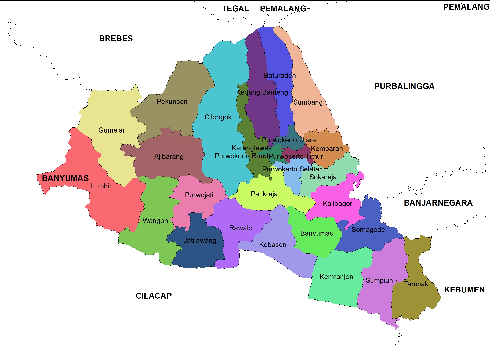
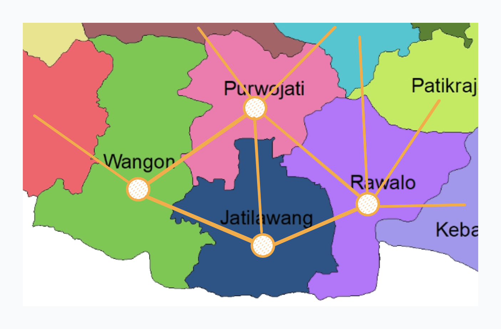
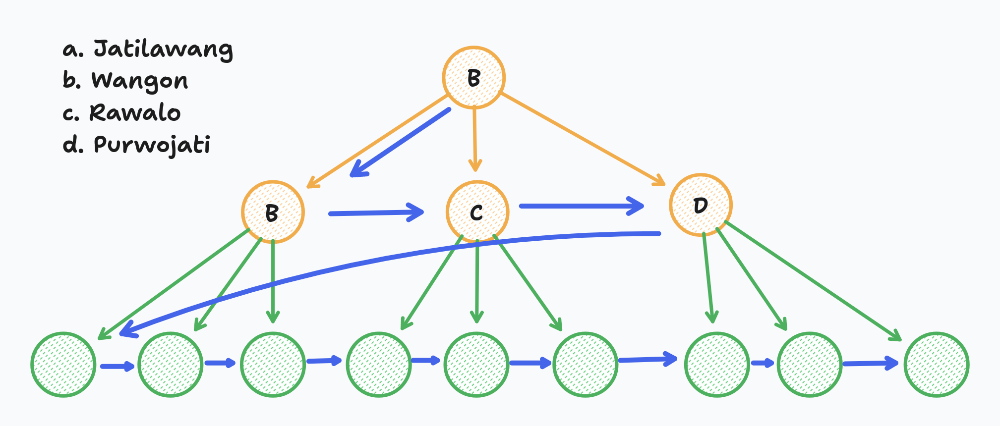

# Gambaran Projek ini

## Fakta

### Node Kecamatan

Banyumas memiliki 27 Kecamatan



### Subgraph dari Kecamatan

Berisi lokasi-lokasi wisata yang ada di suatu kecamatan tersebut

Setiap kecamatan akan dibuat minimal memiliki 3 lokasi wisata sebagai sampel, dengan struktur data index sebagai berikut

```json
{
  "data": [
    {
      "id": 1,
      "kecamatan": "baturaden",
      "wisata": [
        {
          "lokasi": 1,
          "tempatWisata": "Lokawisata Baturaden",
          "coordinate": "M6PH+JJ Karangmangu, Banyumas Regency, Central Java"
        },
        {
          "lokasi": 2,
          "tempatWisata": "Baturraden Adventure Forest",
          "coordinate": "M6VR+5P Karangsalam, Banyumas Regency, Central Java"
        },
        {
          "lokasi": 3,
          "tempatWisata": "Camp Area Umbul Bengkok",
          "coordinate": "M6MR+FM Karangsalam, Banyumas Regency, Central Java"
        }
      ]
    }
  ]
}
```

### Gambaran Graph Keterkaitan

Ide penerapan dari algoritma BFS ini ialah menentukan node terdekat yang tidak bersebrangan dengan titik awal



Gambaran mekanisme:

1. Yang Pertama dilakukan adalah menentukan koordinat awal / origin(titik awal pada Google Map API), misalkan titik awalnya adalah terukur ke Node Kecamatan Jatilawang, lalu sistem akan mencocokan kecamatan yang bersebelahan langsung dengan Jatilawang yang mana pada graph berikut Jatilawang bersebelahan langsung dengan Kecamatan Wangon, Purwojati, dan Rawalo maka gambaran keterkaitannya sebagai berikut

```javascript
let jatilawang = a,
let wangon = b,
let rawalo = c,
let purwojati= d,

matrix = {
    [a,b],
    [a,c],
    [a,d]
}
```

2. Lalu alur dari mekanisme BFS adalah ketika sudah ditentukan titik awal kecamatannya sebagai akar penerapan BFS, lalu sistem akan mencocokan keterkaitan langsung dari antar kecamatan tersebut, dari node cabang pertama pertama, ke node cabang berikutnya

3. Jika sudah tidak ada node yang berhubungan langsung 1 vertex maka akan dicek lagi dari node pertama, subgraph nya, dimulai dari cabang node tempat wisata (children kedua) yang pertama di node kecamatan (children pertama), lalu ke node sebelahnya (node kedua pada children kedua), dst.

4. Jika node pada children tersebut sudah tidak ada, maka naik lagi ke children pertama untuk ke node selanjutnya (kecamatan berikutnya)



> **Catatan**
> Pada projek ini ditentukan radius jarak lokasi terdekat maksimal yaitu adalah 10km, jika pada algoritma BFS tercatat ada 3 lokasi yang masuk dalam algoritma BFS, namun hanya ada 2 yang masuk radius terdekat maka 2 data tempat wisata tersebut yang akan dimunculkan pada Aplikasi